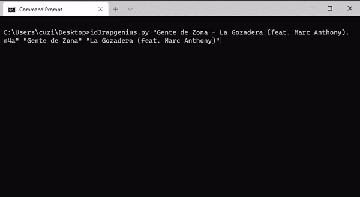
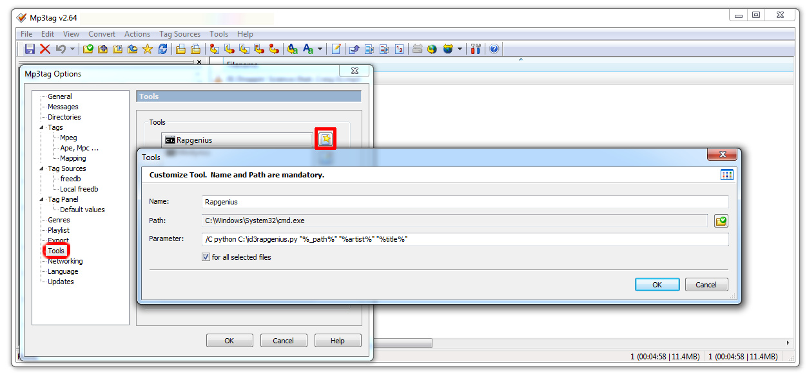

genius downloader
=================

Downloads lyrics from [genius.com](https://genius.com/) and saves the lyrics in a mp3 or m4a file.

You can select the correct lyrics from the first 20 search results.

Written in Python using the mutagen module.

Required:
 * Python 3.8
 * [Mutagen](https://bitbucket.org/lazka/mutagen) python module `pip install mutagen`

**Usage**: python id3rapgenius.py filename artist songname

This was originally inteded as a [Mp3Tag](http://www.mp3tag.de) extension.
To add it to the Mp3Tag context menu, do the following steps in Mp3Tag:
 * Open Tools -> Options -> Tools 
 * Click on the "New" icon
 * Enter the name that shall appear in the context menu
 * For path choose your python.exe
 * For parameter use: C:\pathtofile\id3rapgenius.py "%_path%" "$replace(%artist%,","")" "$replace(%title%,","")"
 * Accept the "for all selected files" option
 
